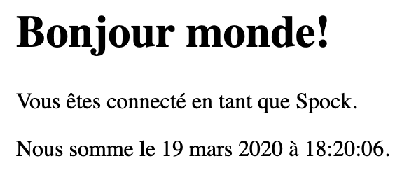

# 0x02. i18n

## About
* Internationalization (I18n) and Localization (L10n)
* Customizing web application to provide multiple language support and local date and number formats

## Tasks
**0. Babel Flask app**
- Flask app with a single `/` route that returns `index.html` template.

- Files:
    - [0-app.py](0-app.py)
    - [templates/0-index.html](templates/0-index.html)

**1. Basic Babel setup**    
- Instantiate the Babel object in your app. Store it in a  module-level variable named babel.

- In order to configure available languages in our app, you will create a Config class that has a LANGUAGES class attribute equal to ["en", "fr"].

- Use Config to set Babel’s default locale (`"en"`) and timezone (`"UTC"`).

- Use that class as config for your Flask app.

- Files:
    - [1-app.py](1-app.py)
    - [templates/1-index.html](templates/1-index.html)

**2. Get local from request**   
- Create a `get_locale` function with the `babel.localeselector` decorator. Use `request.accept_languages` to determine the best match with our supported languages.

- Files:
    - [2-app.py](2-app.py)
    - [templates/2-index.html](templates/2-index.html)

**3. Parametrize templates**
- Use the `_` or `gettext` function to parametrize your templates. Use the message IDs `home_title` and `home_header`.

- Create a `babel.cfg` file containing

- Initialize and compile your translations

- Files:
    - [3-app](3-app.py)
    - [babel.cfg](babel.cfg)
    - [templates/3-index.html](templates/3-index.htmls)
    - [translations/en/LC_MESSAGES/messages.po](translations/en/LC_MESSAGES/messages.po)
    - [translations/fr/LC_MESSAGES/messages.po](translations/fr/LC_MESSAGES/messages.po)
    - [translations/en/LC_MESSAGES/messages.mo](translations/en/LC_MESSAGES/messages.mo)
    - [translations/fr/LC_MESSAGES/messages.mo](translations/fr/LC_MESSAGES/messages.mo)

**4. Force locale with URL parameter**
- Implement a way to force a particular locale by passing the `locale=fr` parameter to your app’s URLs.

- In your `get_locale` function, detect if the incoming request contains locale argument and ifs value is a supported locale, return it. If not or if the parameter is not present, resort to the previous default behavior.

- Files:
    - [4-app.py](4-app.py)
    - [templates/4-index.html](templates/4-index.html)

**5. Mock logging in**
- Creating a user login system is outside the scope of this project. To emulate a similar behavior, copy the following user table in [5-app.py](5-app.py).  

```
users = {
    1: {"name": "Balou", "locale": "fr", "timezone": "Europe/Paris"},
    2: {"name": "Beyonce", "locale": "en", "timezone": "US/Central"},
    3: {"name": "Spock", "locale": "kg", "timezone": "Vulcan"},
    4: {"name": "Teletubby", "locale": None, "timezone": "Europe/London"},
}
````
- This will mock a database user table. Logging in will be mocked by passing login_as URL parameter containing the user ID to log in as.

- Define a `get_user` function that returns a user dictionary or `None` if the ID cannot be found or if login_as was not passed.

- Define a `before_request function` and use the `app.before_request` decorator to make it be executed before all other functions. `before_request` should use `get_user` to find a user if any, and set it as a global on `flask.g.user`.

- In your HTML template, if a user is logged in, in a paragraph tag, display a welcome message otherwise display a default message as shown in the table below.

| msgid | English | French |
| ----- | ------- | ------ |
| `logged_in_as` | `"You are logged in as %(username)s."` | `"Vous êtes connecté en tant que %(username)s."` |
| `not_logged_in` | `"You are not logged in."` | `"Vous n'êtes pas connecté."` |

- Visiting `http://127.0.0.1:5000/` in your browser should display this:

<p align="center"></p>

- Visiting `http://127.0.0.1:5000/?login_as=2` in your browser should display this: 

<p align="center"></p>


- Files: 
    - [5-app.py](5-app.py)
    - [templates/5-index.html](templates/5-index.html)

**6. Use user locale**
- Change your `get_locale` function to use a user’s preferred local if it is supported.
- The order of priority should be
    - Locale from URL parameters
    - Locale from user settings
    - Locale from request header
    - Default locale
- Test by logging in as different users

<p align="center"></p>

- Files:
    - [6-app.py](6-app.py)
    - [templates/6-index.html](templates/6-index.html)

**7. Infer appropriate time zone**
- Define a get_timezone function and use the babel.timezoneselector decorator.

- The logic should be the same as get_locale:
    - Find `timezone` parameter in URL parameters
    - Find time zone from user settings
    - Default to UTC

- Before returning a URL-provided or user time zone, you must validate that it is a valid time zone. To that, use `pytz.timezone` and catch the `pytz.exceptions.UnknownTimeZoneError` exception.

- Files:
    - [7-app.py](7-app.py)
    - [templates/7-index.html](templates/7-index.html)

**8. Display the current time**
- Based on the inferred time zone, display the current time on the home page in the default format. For example:

```
Jan 21, 2020, 5:55:39 AM or 21 janv. 2020 à 05:56:28
```

- Use the following translations:

| msgid | English | French |
| ----- | ------- | ------ |
| `current_time_is` | `"The current time is %(current_time)s."` | `"Nous sommes le %(current_time)s."` |

- Displaying the time in French looks like this:
<p align="center"></p>

- Displaying the time in English looks like this:
<p align="center"></p>

- Files:
    - [app.py](app.py)
    - [templates/index.html](templates/index.html)
    - [translations/en/LC_MESSAGES/messages.po](translations/en/LC_MESSAGES/messages.po)
    - [translations/fr/LC_MESSAGES/messages.po](translations/fr/LC_MESSAGES/messages.po)
